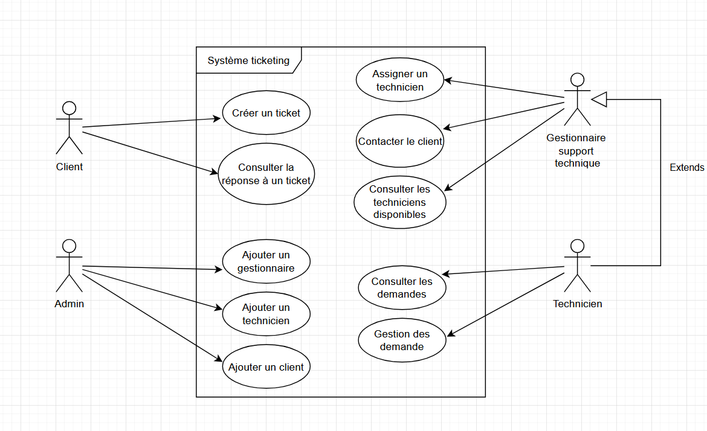
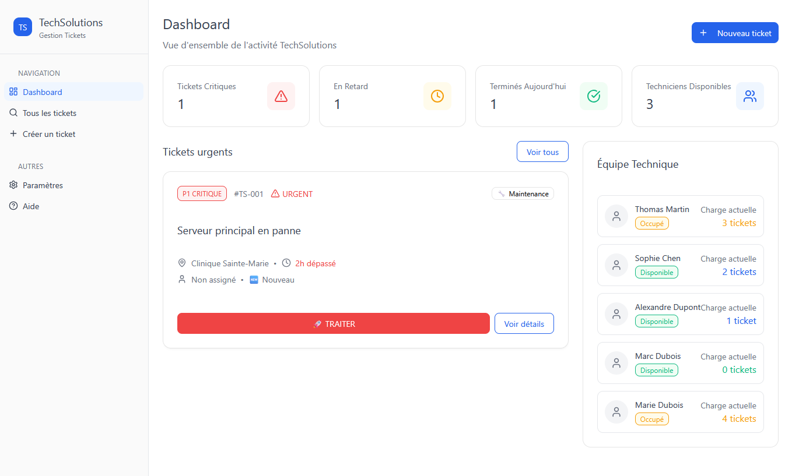
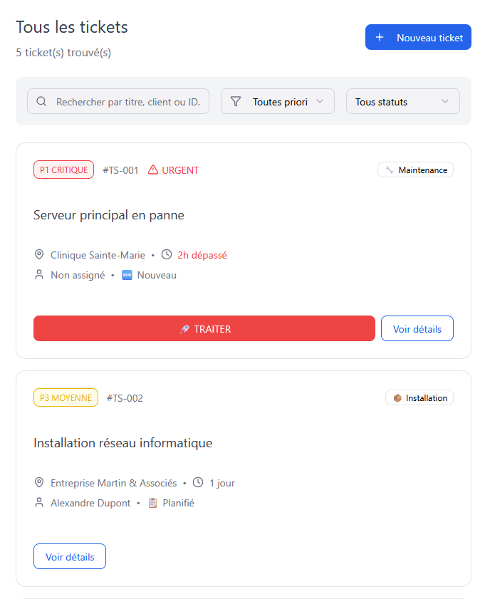

# Site de ticketing

## Analyse des cas d'utilisation

Le client doit être capable d'effectuer une requête en créant un ticket, avec la possibilité de gérer l'urgence de celui-ci. Il doit également être capable de consulter la réponse à son/ses tickets.

Les techniciens doivent être capable de consulter et gérer les demandes sous leur responsabilité. 

Le/les gestionnaire hérite les capacités des techniciens, et doit pouvoir assigner ces derniers à la gestion de tickets spécifiques. Il dois aussi être capable contacter le client, et de consulter les techniciens qui n'ont pas de ticket assigné.

L'admin s'occupe de la gestion globale de l'application et a le droit de rajouter des gestionnaires, techniciens, et clients.

## Présentation des éléments UX

Les éléments utilisés sont conformes à charte graphique et utilisent des couleurs visant à mettre en évidence le statut des requêtes.
L'interface est ergonomique et permet la gestion des tickets en quelques clicks, évitant toute perte de temps.

La recherche de tickets permet de trouver efficacement toute requête en utilisant son ID, ou bien en affinant les recherhes.

## Le lien vers le site

Voici le lien vers le prototype Figma intéractif : https://close-chorus-54377559.figma.site/